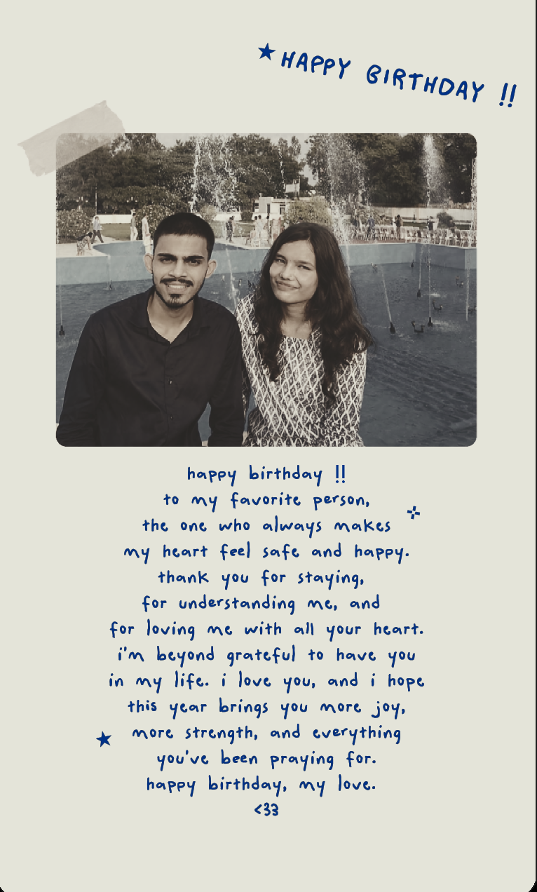
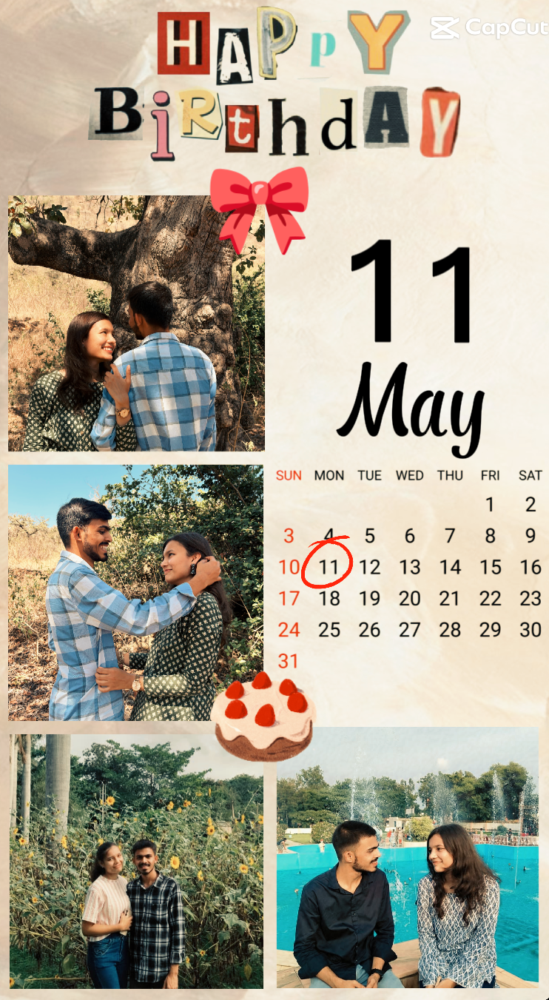
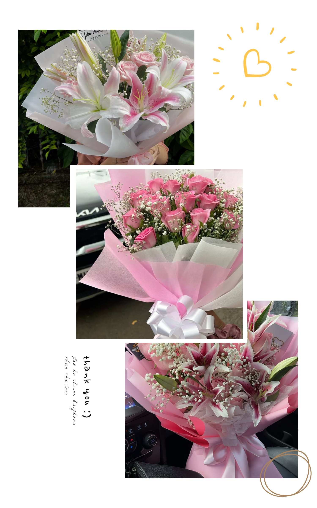

# Birthday-
<!DOCTYPE html>
<html lang="en">
<head>
<meta charset="UTF-8">
<meta name="viewport" content="width=device-width, initial-scale=1.0">

<!-- ✨ Google Font -->
<link href="https://fonts.googleapis.com/css2?family=Dancing+Script&display=swap" rel="stylesheet">

<title>Happy Birthday ❤️</title>

</head>

<body>

<!-- 🎶 MUSIC -->
<audio id="music" loop>
<source src="song.mp3">
</audio>

<!-- 💖 PAGE 1 -->

    

        
        

            <h2>Happy Birthday My Love ❤️</h2>
            
Click the letter 💌

            
💌

        

    

<!-- 💌 PAGE 2 -->

    

        

            Happy Birthday my love ❤️  
            “Happy Birthday to the most annoying person in the world.😏
You irritate me, tease me, make fun of me, and test my patience every single day… yet somehow you’re still my favorite person ever.😭❤️
No matter how much I complain about you, life feels incomplete without your stupid jokes, your drama, and your presence.🥹🫶🏻
Thank you for loving me in the most chaotic yet beautiful way possible.😚🫂
Stay happy, stay crazy, and stay mine forever.
Lysm, idiot.🧿😭🫂💌”
        

        

            
            
        

    

    <button onclick="nextPage(3)">Next ➡️</button>

<!-- PAGE 3 -->

    <h2>Our Memories 🎥</h2>

    <video controls width="500">
        <source src="video1.mp4" type="video/mp4">
    </video>

    <button onclick="nextPage(4)">Next ➡️</button>

<!-- PAGE 4 -->

    <h2>Do you want a surprise gift? 🎁</h2>

    

        <button onclick="sayNo()">No 😢</button>
        <button onclick="nextPage(5)">Yes ❤️</button>
    

    

        
    

    <lp id="msg">

<!-- 🔐 PASSWORD -->

    <h2>Enter Password 🔐</h2>
    <input type="password" id="pass">
     
    <button onclick="check()">Unlock</button>
    

<!-- 🌸 FLOWER PAGE -->

    

        

            
        

    

        <h2>🌸 These flowers are for you 💖</h2>
         
You are more beautiful than all of them ❤️

         <button onclick="nextPage(7)">Next          ➡️</button>

<!-- 🎬 FINAL -->

    <h2>Final Surprise 🎬</h2>
    <video src="final.mp4" 
    controls width="500"></video>
    <button onclick="nextPage(8)">Next ➡️</button>

<!-- ❤️ END -->

    <h2>Thank You For Everything ❤️</h2>
    
I love you forever💗🥹

</body>
</html>
